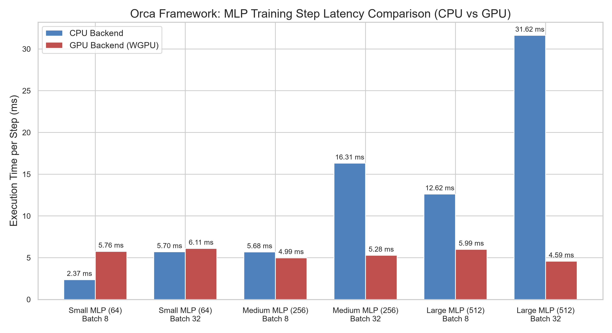

# Orca: Progressive Deep Learning Framework

**"Simple by default. Powerful when needed."**

Orca is a lightweight, modular, and high-performance Machine Learning framework built from the ground up. It leverages the memory safety and native execution speed of **Rust** for its core computational backend, while exposing a clean, intuitive, and progressive Python API.

Currently at version 0.5.0, Orca focuses on providing an extensible architecture where foundational elements like Autograd engines and mathematical primitives are completely decoupled from the physical execution layer (CPU/GPU).

---

## Core Features

- **Progressive Python Frontend**: Simple defaults for beginners, explicit control for researchers and production engineers. The framework implements standard abstractions such as `Tensor`, `nn.Module`, `optim.SGD`, and `DataLoader`.
- **Reverse-Mode Autograd Engine**: A robust, tape-based automatic differentiation engine written entirely in Rust, dynamically building computation graphs during the forward pass.
- **Modular Backend Architecture**: Core ML primitives (mathematical operations, multidimensional shapes, broadcasting) are strictly decoupled from hardware backends. Backends can be swapped seamlessly without rewriting the autograd or frontend layers.
- **Safe, Fast, and SIMD-Ready**: Built 100% in Rust with zero legacy C/C++ dependencies. The CPU backend uses custom aligned memory allocators (64-byte alignment) to ensure type-safe slice casting and future-proof AVX-512/SIMD support.
- **Seamless Python Integration**: Native bindings generated using [PyO3](https://pyo3.rs/) and built using [Maturin](https://maturin.rs/) to guarantee zero-overhead interoperability.

---

## Architecture Structure

The repository is highly decoupled to prevent circular dependencies and enforce clean abstractions. The workspace is divided into the following crates:

- `orca-core/`: The foundational layer. Defines core traits (`Backend`), `Shape`, `DType`, `Device`, and unified error handling (`OrcaError`, `Result`).
- `orca-tensor/`: The multidimensional array representation (`Tensor<B: Backend>`) and forward-pass mathematical operations.
- `orca-autograd/`: The reverse-mode Automatic Differentiation Engine (`Autodiff<B>`) utilizing a Tape-based computation graph for dynamic backpropagation.
- `orca-backend-cpu/`: The reference implementation for a single-threaded CPU Backend featuring robust type dispatching and aligned raw memory storage.
- `orca-backend-gpu/`: An experimental wgpu-based backend designed for cross-platform parallel shader execution.
- `orca-python/`: The Rust-to-Python FFI (Foreign Function Interface) bindings.
- `python/orca/`: The Python frontend providing Object-Oriented ML blocks (`nn`, `optim`, `data`) and autocompletion interfaces.

---

## Installation & Setup

### Prerequisites
- **Python:** 3.10 or higher.
- **Rust:** Stable toolchain via [rustup](https://rustup.rs/).

### Development Installation

1. Clone the repository to your local machine.
2. Create and activate a Python virtual environment:
   ```bash
   python -m venv .venv
   
   # On Linux / macOS:
   source .venv/bin/activate
   
   # On Windows:
   .venv\Scripts\Activate.ps1
   ```
3. Install the Rust bindings compiler (`maturin`) and build the framework:
   ```bash
   pip install maturin
   maturin develop --release
   ```

---

## Quick Start Guide

The Python API follows **simple by default, powerful when needed**. Start with high-level helpers, then drop to explicit loops when research or production constraints require control.

### Beginner Path: Fit, Evaluate, Predict, Save

Use `orca.data.from_arrays(...)` and the high-level model lifecycle when you want the shortest path from data to a reusable checkpoint:

```python
import orca
import orca.nn as nn

train_data = orca.data.from_arrays(
    [[0.0, 0.0], [0.0, 1.0], [1.0, 0.0], [1.0, 1.0]],
    [0, 1, 1, 0],
    batch_size=4,
    one_hot_classes=2,
)

model = nn.Sequential(
    nn.Linear(2, 8),
    nn.ReLU(),
    nn.Linear(8, 2),
)

history = model.compile(
    optimizer="sgd",
    loss="crossentropy",
    lr=0.1,
    metrics=["accuracy"],
).fit(train_data, epochs=10, verbose=1)

print(history["loss"][-1])
print(model.evaluate(train_data))

predictions = model.predict([[1.0, 0.0]], batch_size=1)
model.save("xor.safetensors")

restored = nn.Sequential(nn.Linear(2, 8), nn.ReLU(), nn.Linear(8, 2))
restored.load("xor.safetensors")
print(restored.predict([[1.0, 0.0]], batch_size=1).to_list())
```

For durable metrics, pass `callbacks=[orca.callbacks.CSVLogger("metrics.csv")]`
to `fit(...)` without changing the training loop.

### Advanced Path: Custom Training Loop

Use `ArrayDataset`, `DataLoader`, explicit optimizers, dtype, and device controls when you need a research or production loop:

```python
import orca
import orca.nn as nn
import orca.optim as optim

dataset = orca.data.ArrayDataset(
    [[0.0, 0.0], [0.0, 1.0], [1.0, 0.0], [1.0, 1.0]],
    [0, 1, 1, 0],
    one_hot_classes=2,
)
loader = orca.data.DataLoader(
    dataset,
    batch_size=2,
    shuffle=True,
    seed=42,
    dtype=orca.DType.FLOAT32,
    num_workers=2,
    prefetch_factor=2,
)

model = nn.Sequential(nn.Linear(2, 8), nn.ReLU(), nn.Linear(8, 2))
loss_fn = nn.CrossEntropyLoss()
optimizer = optim.AdamW(model.parameters(), lr=0.01, weight_decay=0.01)

for inputs, targets in loader:
    optimizer.zero_grad()
    predictions = model(inputs)
    loss = loss_fn(predictions, targets)
    loss.backward()
    optimizer.step()
```

Use `num_workers=0` for fully synchronous loading. Increase `num_workers` and
`prefetch_factor` for I/O-bound datasets while keeping batch order deterministic.

---

### Performance & Benchmarks

To evaluate the execution efficiency and scaling properties of the CPU and GPU backends, systematic benchmarks were conducted on a 3-layer Multi-Layer Perceptron (MLP) architecture (Input: 784, Hidden 1: H, Hidden 2: H, Output: 10) across different hidden layer sizes (H = 64, 256, 512) and batch sizes (N = 8, 32).

### Execution Speed and Throughput Comparison

The table below outlines the average execution time per training step (forward pass, cross-entropy loss computation, and backward pass) and the corresponding processing throughput.

| Model Configuration | Batch Size | CPU Time (ms) | GPU (WGPU) Time (ms) | CPU Throughput (samples/s) | GPU (WGPU) Throughput (samples/s) | Speedup (GPU vs CPU) |
| :--- | :---: | :---: | :---: | :---: | :---: | :---: |
| **Small MLP** (H = 64) | 8 | 2.31 | 4.95 | 3461.40 | 1615.95 | 0.47x |
| **Small MLP** (H = 64) | 32 | 5.92 | 4.70 | 5408.58 | 6807.38 | 1.26x |
| **Medium MLP** (H = 256) | 8 | 5.71 | 5.62 | 1400.53 | 1423.84 | 1.02x |
| **Medium MLP** (H = 256) | 32 | 17.01 | 4.67 | 1881.26 | 6849.56 | 3.64x |
| **Large MLP** (H = 512) | 8 | 12.85 | 8.16 | 622.60 | 980.28 | 1.57x |
| **Large MLP** (H = 512) | 32 | 43.24 | 4.71 | 740.07 | 6789.71 | 9.18x |



### Key Observations and Analysis

#### 1. Hardware Scheduling and Shader Launch Overhead
For workloads with smaller dimensions (e.g., Small MLP at Batch Size 8), the CPU backend demonstrates lower latency than the GPU backend. This behavior is attributed to the fixed overhead associated with GPU shader command submission, pipeline binding, and queue synchronization via the WebGPU API. When the actual compute payload is tiny, these kernel launch latencies dominate the overall execution time.

#### 2. Workload Scaling and Parallelization Gains
As the size of the model and the batch size scale up, the massive parallel computing architecture of the GPU backend begins to yield significant performance improvements. For the Large MLP configuration at a batch size of 32, the GPU backend achieves a step latency of 4.71 ms compared to 43.24 ms on the CPU, representing a 9.18x speedup and a processing throughput of 6,789.71 samples per second.

For isolated matrix multiplications of size 1024x1024:
- **CPU Backend (using aligned raw slices)**: 40.46 ms per matmul.
- **GPU Backend (using parallel compute shaders)**: 0.48 ms per matmul.
This yields an approximate 84x acceleration factor for compute-bound GEMM primitives.

---

## Current Status

Orca currently ships the foundation, tensor, autograd, CPU backend, wgpu-based GPU backend, Python bindings, and a TCP distributed baseline. The Python layer also includes `nn`, `optim`, and `data` modules, plus mixed-precision helpers and serialization support.

Implemented today:

- Core types and tensor storage in `orca-core` and `orca-tensor`
- Reverse-mode autograd in `orca-autograd`
- CPU execution in `orca-backend-cpu`
- GPU execution in `orca-backend-gpu`
- Distributed `all_reduce` in `orca-distributed`
- Python bindings in `orca-python`
- Python-side `nn`, `optim`, `data`, `autocast`, and `GradScaler`
- Experimental ONNX import/export helpers under `python/orca/onnx`

Still on the roadmap:

- Production-grade ONNX parity beyond the current experimental helpers
- JIT/compiler and graph optimization
- Multi-node distributed beyond the current TCP baseline
- Mobile/edge targets
- Third-party hardware backends

---

## Contributing Guidelines

We welcome contributions, bug reports, and optimizations. To maintain repository stability and architectural consistency, all contributions must strictly adhere to the guidelines documented in `docs/foundation/` and the rules below.

### 1. Robust Error Handling
- The use of `.unwrap()`, `.expect()`, or `panic!` is strictly prohibited in library code (`src/` directories across all crates).
- Always propagate errors using the workspace's standard result types (`orca_core::Result` and `OrcaError`).

### 2. Strict Crate Hierarchy
- Do not introduce circular dependencies between workspace crates.
- `orca-core` must remain independent of all other crates.
- `orca-autograd` may only depend on `orca-tensor` and `orca-core`.
- Hardware-specific backends (`orca-backend-cpu`, `orca-backend-gpu`) must only depend on `orca-core`.

### 3. Autograd Tape Integrity
- Any custom layer, forward operation, or optimization step must preserve autograd tracking correctness.
- Ensure that training loop iterations, benchmarking steps, and validation routines explicitly call `zero_grad()` to clear the autograd tape and prevent computational graph accumulation.

### 4. GPU Shader Design
- WGSL compute shaders must be verified against device validation limits.
- High-dimensional operations must support decomposed workgroup dispatches to avoid exceeding the Vulkan/DirectX 12 thread boundary constraints (65,535 threads per dimension).

### 5. Code Quality and Testing
- Run Rust formatters and linters before committing:
  ```bash
  cargo fmt --all
  cargo clippy --workspace --all-targets -- -D warnings
  ```
- Ensure all Python test suites run successfully:
  ```bash
  pytest python/tests
  ```

---

## License

This project is licensed under the MIT License or Apache-2.0 License.
